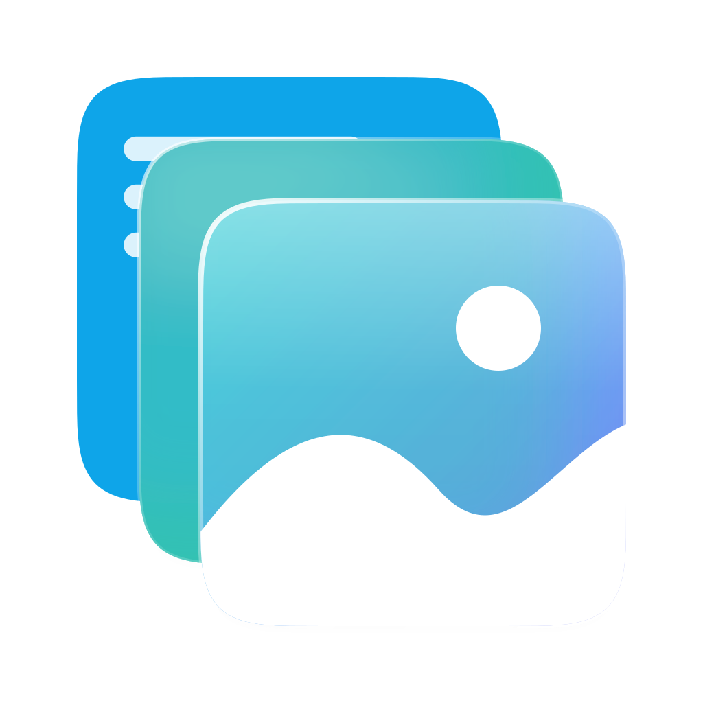

<p align="center"></p>

# Glance

**A free, open-source, lightweight viewer and editor for PDFs, images, camera RAW and 3D models on Windows, inspired by macOS Preview.**

Glance brings Preview's everyday superpowers to Windows: rearranging and merging PDF pages by dragging, dragging pages out to create new files, real redaction, markup and signatures, background removal, metadata scrubbing, batch processing, and more. It's built to feel native on Windows 11 (Fluent design, Mica, Explorer integration) while staying small and fast.

> **Status: early preview.** Viewing, PDF page management, markup, signatures, forms, redaction, OCR, image editing, batch editing and metadata tools work today. Everything else is on the roadmap below and in [`docs/adr`](docs/adr).
>
> **[Download the latest release](https://github.com/RedtRocks/glance/releases/latest)** (Windows 10/11, x64 and ARM64).

## Why it's light

- **Tauri 2 + WebView2**: the UI runs in the Edge engine already built into Windows 10/11, so Glance doesn't ship its own browser. The installer is about 10 MB.
- **Rust backend**: file access and image decoding run natively. Windows' own codecs come first ([WIC](docs/adr/0010-native-first-decoding.md)), so camera RAW and HEIC work whenever Windows supports them.
- **Lazy engines**: the startup bundle is ~35 KB gzipped. PDF.js loads only when you open a PDF, pdf-lib only when you first edit one, and the 3D engine only for models.

## Features

| | Status |
|---|---|
| Tabs, drag-and-drop to open, Open with / Send to, single instance; menus tailored to each file type | ✅ |
| PDF viewing: continuous, single, two-page; zoom; HiDPI rendering; text selection; links | ✅ |
| Thumbnails, table of contents, contact sheet | ✅ |
| Page management: reorder, rotate, delete, duplicate, insert blank/from file, split, merge, undo/redo | ✅ |
| Drag pages between documents (hover a tab to open it; copy, Shift = move) or out of the window to create a PDF; right-click Copy/Move To | ✅ |
| Search, print, slideshow, dark appearance for PDFs | ✅ |
| Export pages as PDF, PNG, JPEG or TIFF (72-600 ppi) | ✅ |
| Context-aware toolbar (page controls only for multi-page documents), Customize Toolbar | ✅ |
| Rebindable keyboard shortcuts (Windows conventions, Preview's shortcuts mapped) | ✅ |
| Formats: PDF, AI, EPS/PS (via Ghostscript), XPS/OXPS, JPEG, PNG, GIF, WebP, AVIF, BMP, ICO, SVG, TIFF, HEIC, JPEG 2000, JPEG XL, JPEG XR, EXR, HDR, TGA, DDS, QOI, PNM, ICNS, PSD, CBZ, camera RAW ([full list](docs/FORMATS.md)); Open With another app for PSD, AI and RAW | ✅ |
| Markup: sketch (shape recognition), draw, rectangle, rounded rectangle, oval, line, arrow, star, polygon, speech bubble, loupe (magnifier), text boxes in any installed font, notes, highlight (any color), underline, strikethrough, squiggly underline | ✅ |
| Markup saved as standard, editable PDF annotations (reopen in Glance to keep editing) | ✅ |
| Signatures: draw with mouse/pen (pressure), capture with the camera, or import a photo; stored encrypted with Windows DPAPI | ✅ |
| Fill in PDF forms | ✅ |
| Redaction that truly removes content (pages rasterized; form data, thumbnails, tags and orphaned objects purged); Remove Sensitive Text finds names, emails, phone, card and ID numbers | ✅ |
| Text recognition (Windows OCR): scanned PDFs become searchable and selectable; copy text from images | ✅ |
| Highlights & Notes sidebar, bookmarks | ✅ |
| Remove Background and Copy Subject with a bundled AI model (U²-Net-p, runs locally in Rust) | ✅ |
| Instant Alpha; rectangular, elliptical, lasso and smart-lasso selection; crop, delete, invert selection | ✅ |
| Adjust Color (exposure, contrast, highlights, shadows, saturation, temperature, tint, sepia, definition, sharpness, gamma, levels with histogram, Auto Levels) with live preview | ✅ |
| Adjust Size (fit-into presets, units, resolution), rotate and flip | ✅ |
| Markup on images, flattened on save; export as PNG, JPEG, WebP, TIFF, BMP or PDF, optionally converted to Display P3, Adobe RGB or Gray | ✅ |
| Inspector (Ctrl+I): EXIF, color profile, PDF properties; Remove Location | ✅ |
| Batch Edit Images: rotate, flip, resize, convert, remove location | ✅ |
| Set an image as the desktop background or lock screen | ✅ |
| Autosave and version history (File → Browse Versions); Clean Up PDF (annotations, links, metadata, attachments, scripts) | ✅ |
| Share (Windows share sheet), Send to, update notifications you can skip or turn off | ✅ |
| 3D models: GLB/glTF, OBJ, STL, PLY, 3MF, DAE, FBX, USDZ, 3DS (orbit, wireframe, turntable, animations, snapshot) | ✅ |
| Create Collage (justified rows or grid) | ✅ |
| Password-protected PDF export (AES-256, permissions), Reduce File Size, New from Clipboard, Import from Scanner | ✅ |
| Windows 11 context menu (needs a signed build) | Milestone 6 |

Signing on an iPhone or iPad (Preview's Continuity feature) isn't possible on Windows; use the camera or a photo of your signature instead.

Glance deliberately has no quick-look popup: pair it with [PowerToys Peek](https://learn.microsoft.com/windows/powertoys/peek) (Ctrl+Space in Explorer) and press Enter to continue in Glance ([ADR 0011](docs/adr/0011-no-quick-look-pair-with-peek.md)).

## Privacy

No telemetry and no accounts. The only network request is an optional daily check for a newer release on GitHub (turn it off in Settings). Background removal and text recognition run on your PC.

## Building from source

Requirements: Node.js 22+, Rust (stable), and on Windows the WebView2 runtime (preinstalled on Windows 10/11).

```sh
npm install
npm run tauri dev        # run with hot reload
npm run tauri build      # produce the NSIS installer in src-tauri/target/release/bundle/nsis
npm test                 # frontend unit tests
cd src-tauri && cargo test   # decoder tests (WIC tests run on Windows)
```

Every pull request builds a Windows installer in CI (see the `glance-windows-x64-installer` artifact).

## Project layout

```
src/                 Preact UI
  core/              Pure logic (page operations, shortcuts, page-control rules), unit tested
  pdf/               PDF.js integration: rendering, thumbnails, search
  state/             Documents, commands registry, actions, settings
  ui/                Components (toolbar, sidebar, views, dialogs)
  platform/          Bridge to the Rust backend (with a browser fallback for UI testing)
src-tauri/           Rust backend
  src/decode/        Image decoding: WIC, JPEG 2000, JPEG XL, PSD, ICNS, RAW previews, EPS, CBZ
  src/protocol.rs    glance:// scheme serving files and decoded images to the UI
docs/adr/            Architecture decision records
CONTEXT.md           Domain glossary
```

## Contributing

Issues and pull requests are welcome. Please read [`CONTEXT.md`](CONTEXT.md) for the project's vocabulary and [`docs/adr`](docs/adr) for the decisions behind the design.

## License

[Apache-2.0](LICENSE). Glance never bundles GPL/AGPL components. Ghostscript, used for PostScript, is run as a separate program only if you install it.
